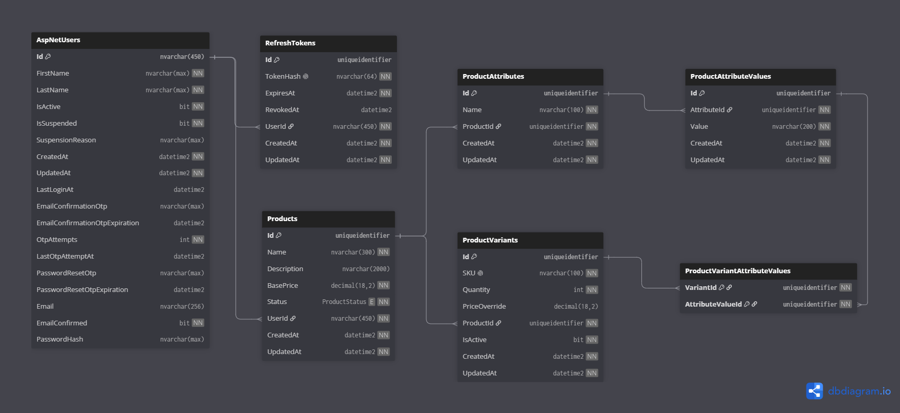

# ECommerce Platform API

A production-ready backend service for a multi-vendor e-commerce platform built with **ASP.NET Core 9**, **Entity Framework Core**, **SQL Server**, and **ASP.NET Identity**. Merchants can independently manage their own products and variants through a RESTful API with strict ownership isolation and a flexible, schema-agnostic variant system.

---

## Table of Contents

- [Architecture Overview](#architecture-overview)
- [Technology Stack](#technology-stack)
- [Project Structure](#project-structure)
- [Setup Instructions](#setup-instructions)
- [Environment Configuration](#environment-configuration)
- [Database Design](#database-design)
- [API Documentation](#api-documentation)
- [Features & Bonus Points](#features--bonus-points)
- [Design Decisions](#design-decisions)

---

## Architecture Overview

The project follows **Clean Architecture** organized into five projects with a strict inward dependency rule:

```
┌──────────────────────────────────────────────────┐
│                  ECommerce.Api                   │
│        Controllers · Swagger · Middleware        │
├──────────────────────────────────────────────────┤
│           ECommerce.Infrastructure               │
│          JWT · Email · OTP Services              │
├──────────────────────────────────────────────────┤
│             ECommerce.Persistence                │
│        EF Core · Repositories · Identity         │
├──────────────────────────────────────────────────┤
│             ECommerce.Application                │
│        CQRS/MediatR · Validators · DTOs          │
├──────────────────────────────────────────────────┤
│               ECommerce.Domain                   │
│         Entities · Enums · Exceptions            │
└──────────────────────────────────────────────────┘
```

**Key Design Decisions:**
- **CQRS with MediatR** — every operation is an `IRequest<T>` handled by a dedicated handler, keeping controllers thin.
- **Pipeline Behaviors** — `LoggingBehavior` and `ValidationBehavior` run automatically on every request via MediatR's pipeline.
- **Repository + Unit of Work** — data access is abstracted behind interfaces, enabling full mock-based unit testing.
- **Global Exception Handler** — middleware maps domain exceptions (`NotFoundException`, `ForbiddenException`, etc.) to consistent JSON responses.
- **Ownership validation at the application layer** — handlers fetch the resource first (404 if missing), then check ownership (403 if mismatched), producing semantically correct HTTP responses.

---

## Technology Stack

| Category | Technology |
|---|---|
| Framework | ASP.NET Core 9 |
| Language | C# 13 |
| Database | SQL Server 2022 |
| ORM | Entity Framework Core 9 |
| Identity | ASP.NET Core Identity |
| Authentication | JWT Bearer + Refresh Tokens |
| Mediator | MediatR |
| Validation | FluentValidation |
| Caching | `IMemoryCache` |
| Email | MailKit (SMTP) |
| Documentation | Swagger / OpenAPI |
| Testing | xUnit + Moq |
| Containerization | Docker + Docker Compose |

---

## Project Structure

```
e-commerce-backend/
├── src/
│   ├── ECommerce.Api/
│   │   ├── Controllers/          # Authentication, Catalog, Variants, Attributes
│   │   ├── Services/             # CurrentUserService (reads JWT claims)
│   │   ├── Infrastructure/       # Swagger configuration
│   │   └── Program.cs
│   ├── ECommerce.Application/
│   │   ├── Features/             # CQRS commands & queries (Auth, Catalog, Variants)
│   │   ├── Common/               # Behaviors (Logging, Validation), Caching
│   │   ├── Contracts/            # Repository & service interfaces
│   │   └── ResourceParameters/   # Filtering, sorting, pagination params
│   ├── ECommerce.Domain/
│   │   ├── Entities/             # Product, ProductVariant, ApplicationUser, etc.
│   │   ├── Enums/                # ProductStatus
│   │   └── Exceptions/           # NotFoundException, ForbiddenException, etc.
│   ├── ECommerce.Infrastructure/
│   │   ├── Services/             # JwtTokenGeneration, EmailService, OtpService
│   │   └── Middleware/           # GlobalExceptionHandler
│   └── ECommerce.Persistence/
│       ├── Repositories/         # ProductRepository, VariantRepository, IdentityService
│       ├── Configurations/       # EF Core Fluent API configs
│       └── Migrations/
└── test/
    ├── ECommerce.Domain.Tests/
    ├── ECommerce.Application.Tests/
    └── ECommerce.Integration.Tests/
```

---

## Setup Instructions

### Prerequisites
- [.NET 9 SDK](https://dotnet.microsoft.com/download/dotnet/9)
- SQL Server 2019+ **or** Docker

### Running Locally

```bash
git clone <repository-url>
cd "e-commerce backend"

# Update appsettings.json with your SQL Server connection string
dotnet restore ECommerce.sln
dotnet run --project src/ECommerce.Api/ECommerce.Api.csproj
```

The database is created and migrated automatically on startup. Swagger UI is available at `http://localhost:5000/swagger`.

### Running with Docker

```bash
docker-compose up --build
```

Starts the API on `http://localhost:5000` and SQL Server on port `1433`. The API waits for SQL Server's health check before starting.

### Running Tests

```bash
dotnet test ECommerce.sln
```

---

## Environment Configuration

All configuration lives in `appsettings.json`. The critical sections are:

### Connection String
```json
"ConnectionStrings": {
  "DefaultConnection": "Server=localhost;Database=CloudCoECommerce;Trusted_Connection=True;TrustServerCertificate=True"
}
```

### JWT Settings
```json
"Jwt": {
  "Key": "YOUR_SECRET_KEY_MIN_32_CHARACTERS",
  "Issuer": "ECommerce.Api",
  "Audience": "ECommerce.Users",
  "AccessTokenExpiryMinutes": 15,
  "RefreshTokenExpiryDays": 30
}
```

### Email (SMTP / Gmail App Password)
```json
"Email": {
  "SmtpServer": "smtp.gmail.com",
  "SmtpPort": 587,
  "SenderName": "ECommerce Platform",
  "SenderEmail": "your@email.com",
  "SmtpUsername": "your@gmail.com",
  "SmtpPassword": "your-16-char-app-password"
}
```

---

## Database Design

### ERD Diagram



### Entity Mapping & Relationships

| Relationship | Type | Description |
|---|---|---|
| `AspNetUsers` → `Products` | One-to-Many | A merchant owns multiple products |
| `AspNetUsers` → `RefreshTokens` | One-to-Many | A user can have multiple active sessions |
| `Product` → `ProductAttributes` | One-to-Many | A product defines its own attribute types (e.g., Color, RAM) |
| `ProductAttribute` → `ProductAttributeValues` | One-to-Many | Each attribute has multiple possible values (e.g., Red, Blue) |
| `Product` → `ProductVariants` | One-to-Many | A product has multiple purchasable variants |
| `ProductVariant` ↔ `ProductAttributeValues` | Many-to-Many | A variant is a combination of values, linked via `ProductVariantAttributeValues` |

### Design Justification

#### Why EAV for Product Variants?

A T-Shirt has `Color` and `Size`; a Laptop has `RAM` and `Storage`. No approach based on hardcoded columns can handle both without schema changes per product type.

The four-table EAV model — `ProductAttributes`, `ProductAttributeValues`, `ProductVariants`, `ProductVariantAttributeValues` — stores attribute definitions as data, not columns. A new product category requires zero migrations.

**Trade-off:** Fetching variant details requires joins across four tables instead of one. This is mitigated by EF Core eager loading (`Include`/`ThenInclude`) and pagination on all list endpoints.

#### Why `IMemoryCache`?

This is a single-instance deployment. In-memory cache provides the fastest possible access with zero infrastructure overhead. The caching logic is encapsulated behind `IProductCacheSignal`, so migrating to `IDistributedCache` (Redis) when horizontal scaling is required is a localized change.

---

## API Documentation

Full interactive documentation is available at `/swagger`. All endpoints include `[ProducesResponseType]` annotations and JWT Bearer support.

### Authentication

| Method | Endpoint | Auth | Description |
|---|---|---|---|
| `POST` | `/api/Authentication/register` | No | Register a merchant account |
| `POST` | `/api/Authentication/login` | No | Login and receive tokens |
| `POST` | `/api/Authentication/refresh-token` | No | Exchange refresh token for new tokens |
| `POST` | `/api/Authentication/logout` | Yes | Revoke all active sessions |
| `POST` | `/api/Authentication/revoke-token` | Yes | Revoke a specific token |
| `POST` | `/api/Authentication/confirm-email` | No | Confirm email with OTP |
| `POST` | `/api/Authentication/resend-confirmation-otp` | No | Re-send confirmation OTP |
| `POST` | `/api/Authentication/forgot-password` | No | Request a password reset OTP |
| `POST` | `/api/Authentication/reset-password` | No | Reset password with OTP |

### Products

| Method | Endpoint | Auth | Description |
|---|---|---|---|
| `POST` | `/api/Catalog` | Merchant | Create a product |
| `GET` | `/api/Catalog` | Merchant | List own products (filtered, paginated) |
| `GET` | `/api/Catalog/{id}` | Merchant | Get product details |
| `PUT` | `/api/Catalog/{id}` | Merchant (Owner) | Update a product |
| `DELETE` | `/api/Catalog/{id}` | Merchant (Owner) | Delete a product |

**Query parameters:** `searchQuery`, `status`, `minPrice`, `maxPrice`, `fromDate`, `toDate`, `sortBy`, `sortDescending`, `pageNumber`, `pageSize` (max 50)

### Variants

| Method | Endpoint | Auth | Description |
|---|---|---|---|
| `POST` | `/api/Catalog/{productId}/Variants` | Merchant (Owner) | Create a variant |
| `GET` | `/api/Catalog/{productId}/Variants` | Merchant (Owner) | List variants (filtered, paginated) |
| `GET` | `/api/Catalog/{productId}/Variants/{id}` | Merchant (Owner) | Get variant details |
| `PUT` | `/api/Catalog/{productId}/Variants/{id}` | Merchant (Owner) | Update a variant |
| `DELETE` | `/api/Catalog/{productId}/Variants/{id}` | Merchant (Owner) | Delete a variant |

**Variant fields:** `sku` (globally unique), `quantity`, `priceOverride` (nullable), `isActive`, `attributeValueIds`

### Attributes

| Method | Endpoint | Auth | Description |
|---|---|---|---|
| `POST` | `/api/Catalog/{productId}/Attributes` | Merchant (Owner) | Add an attribute |
| `GET` | `/api/Catalog/{productId}/Attributes` | No | List attributes and values |
| `PATCH` | `/api/Catalog/{productId}/Attributes/{id}` | Merchant (Owner) | Rename an attribute |
| `DELETE` | `/api/Catalog/{productId}/Attributes/{id}` | Merchant (Owner) | Delete an attribute |
| `POST` | `/api/Catalog/{productId}/Attributes/{id}/Values` | Merchant (Owner) | Add a value |
| `PATCH` | `/api/Catalog/{productId}/Attributes/{id}/Values/{vid}` | Merchant (Owner) | Update a value |
| `DELETE` | `/api/Catalog/{productId}/Attributes/{id}/Values/{vid}` | Merchant (Owner) | Delete a value |

---

## Features & Bonus Points

| Feature | Status | Details |
|---|---|---|
| JWT Authentication | ✅ | Access token (15 min) + refresh token (30 days, SHA-256 hashed) |
| Merchant Isolation | ✅ | Ownership enforced in every handler — 404 vs 403 distinction |
| Product CRUD | ✅ | Full CRUD with search, filtering, sorting, pagination |
| Flexible Variant System | ✅ | EAV pattern — unlimited attributes, values, and combinations |
| Attribute Management | ✅ | Full CRUD for attributes and values per product |
| Swagger / OpenAPI | ✅ | Bearer token support, ProducesResponseType annotations |
| Global Exception Handling | ✅ | Middleware maps domain exceptions to structured JSON responses |
| Validation | ✅ | FluentValidation via MediatR pipeline; per-field error details |
| Logging | ✅ | HTTP request logging + MediatR pipeline logging on every request |
| Caching | ✅ | In-memory cache with `CancellationToken`-based invalidation on mutations |
| Docker | ✅ | Multi-stage Dockerfile + Docker Compose with SQL Server health check |
| Unit Tests | ✅ | 8 tests — domain entity, command handler, and validator tests (xUnit + Moq) |
| Integration Tests | ✅ | 3 tests — auth flow, product lifecycle, and cache invalidation |
| Email OTP Flows | ✅ | Email confirmation and password reset via 6-digit OTP (MailKit) |
